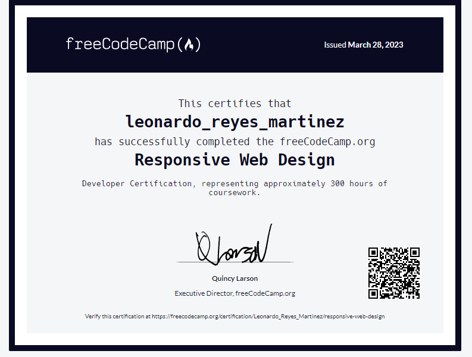

    
    <h1 align="center">Hola 👋, Soy Leonardo</h1>
    <h3 align="center">Un desarrollador BackEnd de México. En proceso de aprendizaje con el desarrollo y mantenimiento de aplicaciones web escalables y robustas. Me apasiona la creación de soluciones que resuelvan problemas y mejoren la experiencia del usuario. Además, me gusta mantenerme actualizado en las últimas tendencias y tecnologías en el mundo del desarrollo de BackEnd.</h3>

---

### 👨‍💻 Acerca de mí :

- 📝 Siempre estoy aprendiendo tecnologías nuevas

- 💬 Preguntame sobre **Javascript**

- 📫 Como contactarme **pepinillosmtzswag@gmail.com**

- 🌱 Actualmente estoy aprendiendo **JavaScript**

-  🧑‍💻 Soy un desarrollador autodidacta. *"Si estás aprendiendo algo por tu cuenta, siempre hay un punto en el que te sientes solo, por eso es importante rodearse de otras personas con intereses similares o que tengan una perspectiva similar para mantenerte motivado."* **-Elon Musk**

    <h3>🔨 Lenguajes y herramientas:</h3>
    

        &nbsp;
               &nbsp;
                &nbsp;
        &nbsp;
        
      

---

### 📊 Mis estadísticas :

---

Extra:
Cuento con un certificado web sobre diseño responsivo

