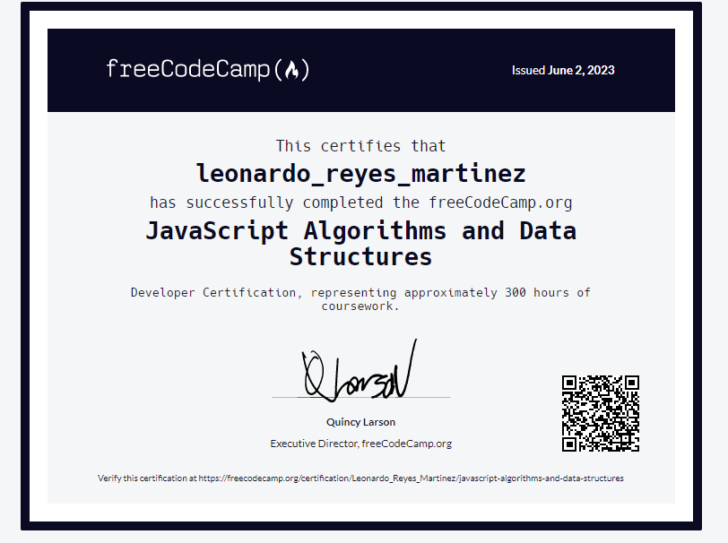

    
    <h1 align="center">Hi 👋, I'm Leonardo</h1>
    <h3 align="center">A Mexican BackEnd developer. In the process of learning about the development and maintenance of scalable and robust web applications. I'm passionate about creating solutions that solve problems and improve the user experience. Additionally, I enjoy staying up to date on the latest trends and technologies in the world of BackEnd development.</h3>

---

### 👨‍💻 About me :

- 📝 I'm always learning new technologies

- 💬 Ask me about **Bussiness**

- 📫 You can reach me at **pepinillosmtzswag@gmail.com**

- 🌱 Currently, I'am learning **ReactJS**

-  🧑‍💻 I'm a self-taught developer. *"When you're learning something on your own, there always comes a ponit where you feel alone, that's why it's important to surround yourself with like-minded people or those who have a similar perspective to stay motivated."* **-Elon Musk**
-  🫵 *"Weak individuals give up when they are tired, pain is the ultimate growth*, **STAY HARD MOTHERFuCKERS !**" - **David Goggins**
  

    <h3>🔨 Languages and Tools:</h3>
    

        &nbsp;
               &nbsp;
                &nbsp;
        &nbsp;
        
        &nbsp;
        &nbsp;
        &nbsp;
        &nbsp;
      

---

### 📊 My Stats :

---

Extra:
I have certificate in JavaScript

